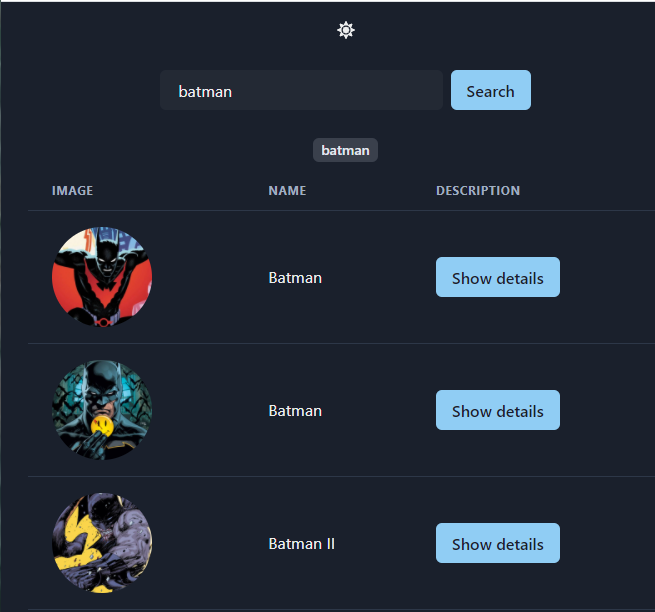

# [Superhero-search-app](https://superhero-search-app.netlify.app/)

> Superhero search

## See [DEMO](https://superhero-search-app.netlify.app/)

## Technologies

- React
- Chakra UI
- API https://superheroapi.com/
- AXIOS
- Storybook

## Requirements

Based on https://superheroapi.com/, please write a web application that will allow you to search for
heroes.

It is necessary to display a list of heroes with a photo and name of the hero, and after clicking,
showing the detailed characteristics of the hero (photo, bio, statistics).

Recommended libraries:

- React or any other library or framework;

- Bootstrap or any other graphics library.

The project should have an organized structure and basic component tests (snapshots).

main.js
// module.exports = {
//   "stories": [
//     "../src/**/*.stories.mdx",
//     "../src/**/*.stories.@(js|jsx|ts|tsx)"
//   ],
//   "addons": [
//     "@storybook/addon-links",
//     "@storybook/addon-essentials",
//     "@storybook/preset-create-react-app"
//   ]
// }

module.exports = {
  stories: ["../src/**/*.stories.js"],
  addons: ["@storybook/preset-create-react-app"]
};

package.json
  // "start": "cross-env PORT=3001 react-scripts start",
     // "storybook": "start-storybook -p 6006 -s public",
